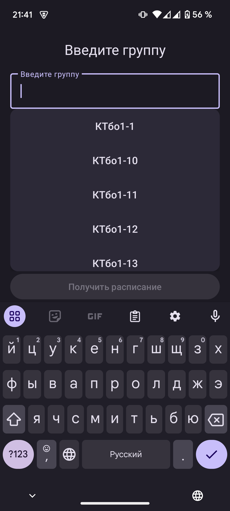
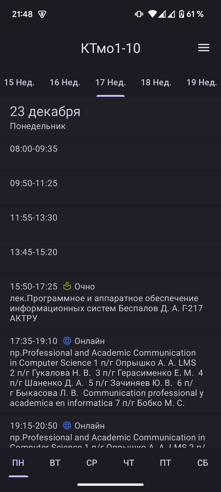
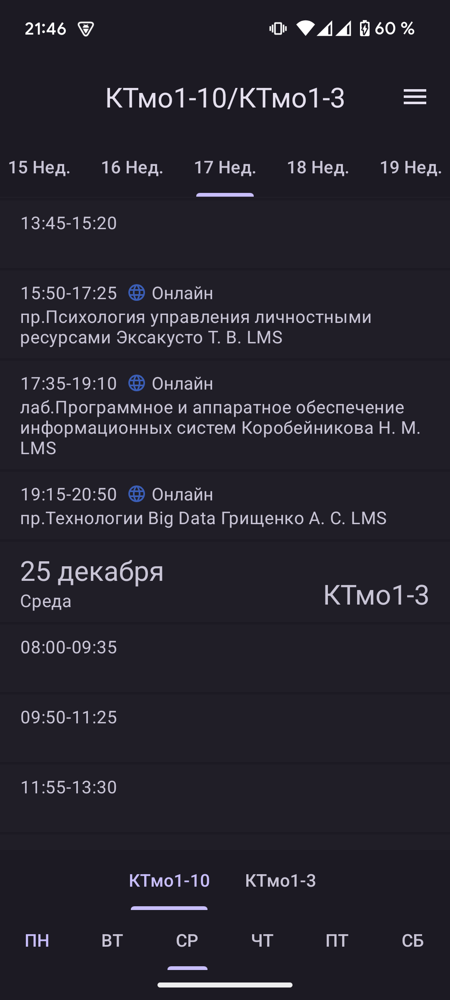
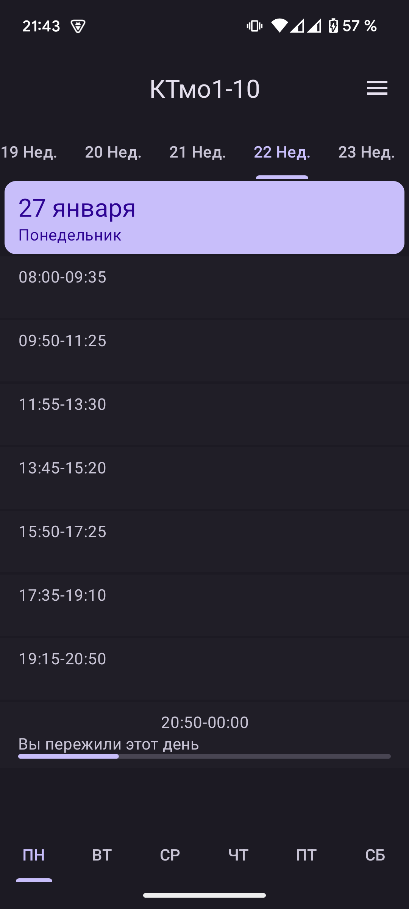
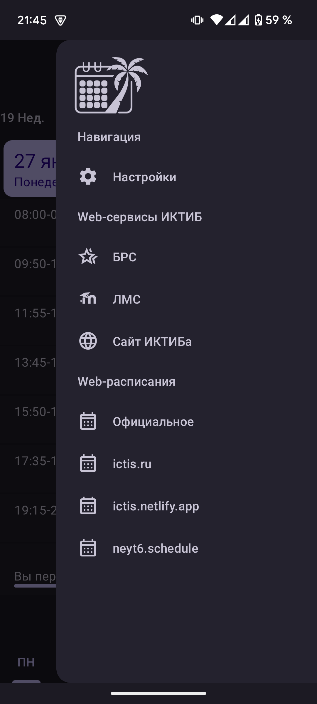
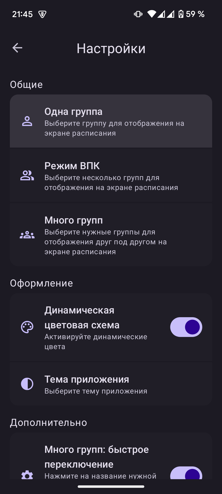
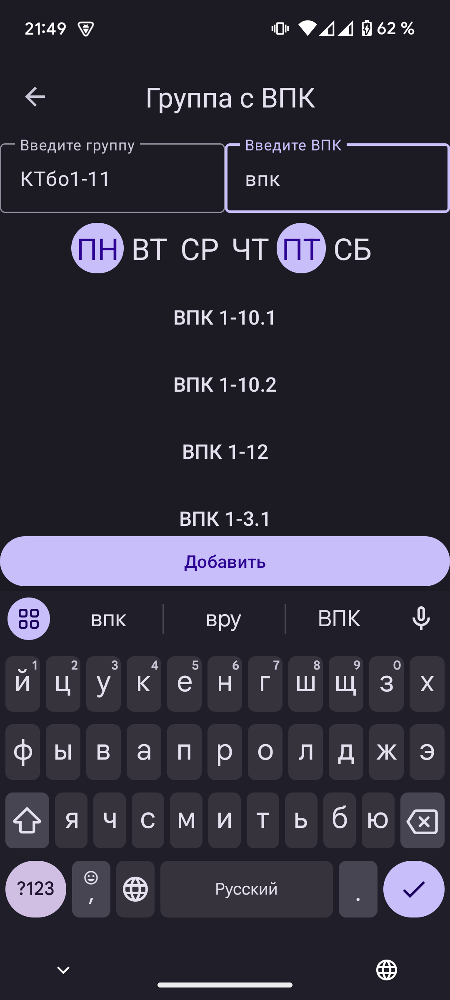

## ScheduleAppK (ИКТИБ Расписание)
Приложение, которое получает расписание учебных групп ИКТИБа

## Скриншоты
<div>







</div>

## Библиотеки и зависимости
- Retrofit
- Room
- RxKotlin
- Hilt
- MVVM
- View based

## Модульная архитектура
В проекте используется подход с разделением частей приложения на модули с помощью gradle. Архитектура взята с проекта google [Now in Android](https://github.com/android/nowinandroid).
Глобально проект делится на core (всю логику приложения) и features (fragments и прочий код представления)

   ```markdown
   core
   ├── data
   ├── database
   ├── domain
   ├── models
   ├── network
   ├── sharpref
   ├── utils
   ├── values
   ├── views
   features
   ├── enter
   ├── schedule
   ├── settings
```
- models - сущности, которые используются во всех слоях.
- sharpref, database, network - слой данных для получения данных из сети (retrofit), из базы данных (room), из shared preferences (для экрана настроек).
- data, domain - слой данных для выполнения операций над данными и предоставления функций в слой представления.
- features - fragments, viewmodels и все остальное, связанное с представлением.
- values - стили, строки, темы и прочее в xml формате.
- views - различные view, которое могут переиспользоваться в модулях.
- utils - kotlin расширения, basefragment и прочее классы для слоя представления.
```markdown
                    features   
   ↙	      ↙         ↓        ↘ 
utils	   views       data     domain
             ↓          ↓  ↓  ↓  ↓  ↓  ↓  ↓  ↓  ↓  
           values	sharpref   database   network
                        ↓  ↓  ↓  ↓  ↓  ↓  ↓  ↓  ↓ 
                                  models
```
