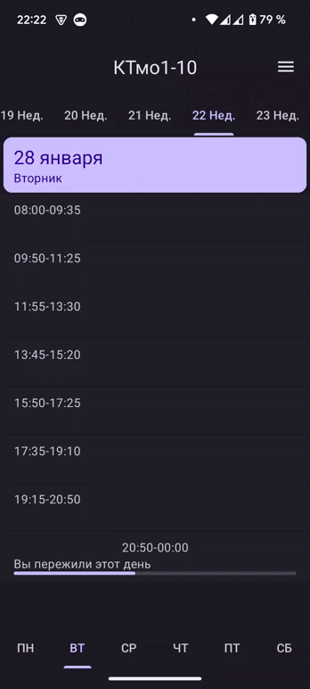

<div align="center">


# ИКТИБ РАСПИСАНИЕ
</div>


<div align="center">

[](https://app.ictis.ru/)

</div>

<div align="center">

[](https://play.google.com/store/apps/details?id=com.ita.schedule&pli=1)
[](https://www.rustore.ru/catalog/app/com.ita.schedule)
[](https://t.me/ictis_timetable)

</div>

## ScheduleAppK (ИКТИБ Расписание)
Приложение, которое получает расписание учебных групп ИКТИБа.


## Скриншоты
<div>


</div>

## Библиотеки, зависимости и архитектурные подходы
- Retrofit
- Room
- RxKotlin
- Hilt
- MVVM
- View based

В приложении используется стандартный набор библиотек для работы с сетью и базой данных, используется MVVM подход, а слой презентации написан на View с использованием View Binding.
## Функционал
- ###### Просмотр расписания
	- Можно просматривать расписания учебных групп, преподавателей, аудиторий, впк и всего того, что доступно на [сайте расписания](https://ictis.sfedu.ru/schedule/)
- ###### Статус занятия и длительность
	- Отображает формат занятия: очное или дистанционный формат, а также прогресс завершенности текущего занятия.
- ###### Несколько режимов отображения
	- Можно просматривать расписание одной группы, нескольких групп или отобразить группу вместе с впк.
- ###### Поддержка светлой и темной темы, а также DynamicColors

Вход в приложение:


Пример поиска группы: если нажать на наименование текущей группы в toolbar, то развернется меню поиска. Поиск также можно осуществить в настройках приложения.



## Модульная архитектура
В проекте используется подход с разделением частей приложения на модули с помощью gradle. Архитектура взята с проекта google [Now in Android](https://github.com/android/nowinandroid).
Глобально, проект делится на core (всю логику приложения) и features (fragments и прочий код представления).

   ```markdown
   core
   ├── data
   ├── database
   ├── domain
   ├── models
   ├── network
   ├── sharpref
   ├── utils
   ├── values
   ├── views
   features
   ├── enter
   ├── schedule
   ├── settings
```
- models - сущности, которые используются во всех слоях.
- sharpref, database, network - слой данных для получения данных из сети (retrofit), из базы данных (room), из shared preferences (для экрана настроек).
- data, domain - слой данных для выполнения операций над данными и предоставления функций в слой представления.
- features - fragments, viewmodels и все остальное, связанное с представлением.
- values - стили, строки, темы и прочее в xml формате.
- views - различные view, которые могут переиспользоваться в модулях.
- utils - kotlin расширения, basefragment и прочее классы для слоя представления.
```markdown
                    features   
   ↙	      ↙         ↓        ↘ 
utils	   views       data     domain
             ↓          ↓  ↓  ↓  ↓  ↓  ↓  ↓  ↓  ↓  
           values	sharpref   database   network
                        ↓  ↓  ↓  ↓  ↓  ↓  ↓  ↓  ↓ 
                                  models
```
</div>
